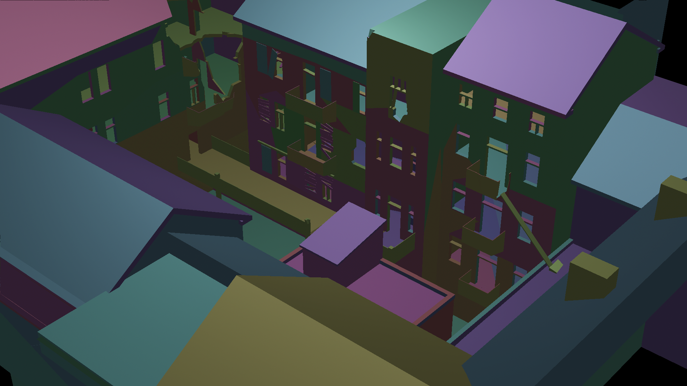
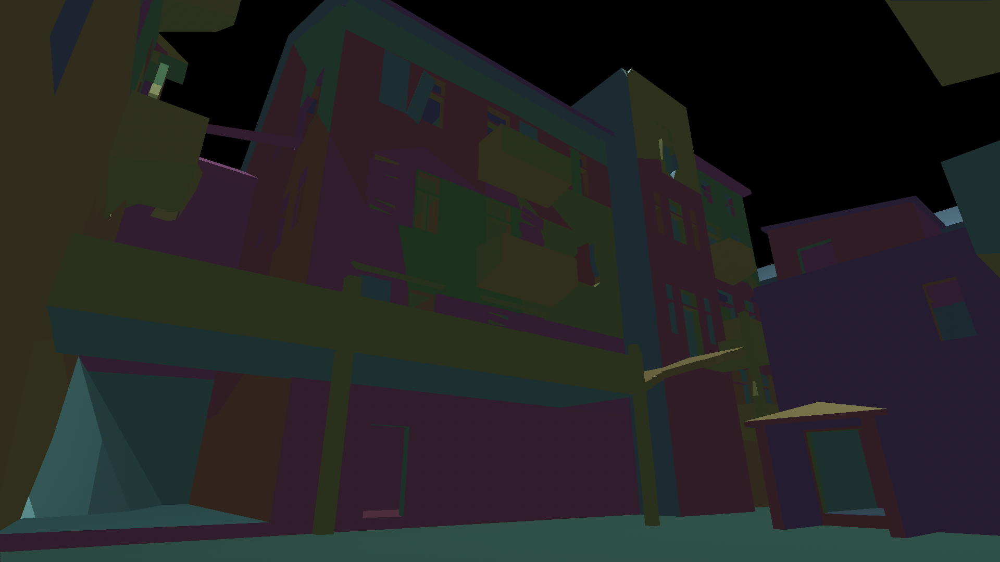
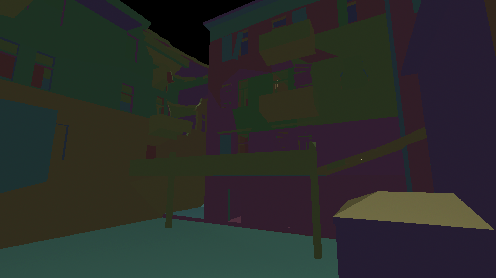

# R5Raster
This is a toy rasterizer project of mine, built in a week from scratch. Mostly to try out my M4 Pro really :D

# Live rendering demo
[https://o-micron.github.io/R5Raster/](https://o-micron.github.io/R5Raster/)

# Screenshots

  

  

  

